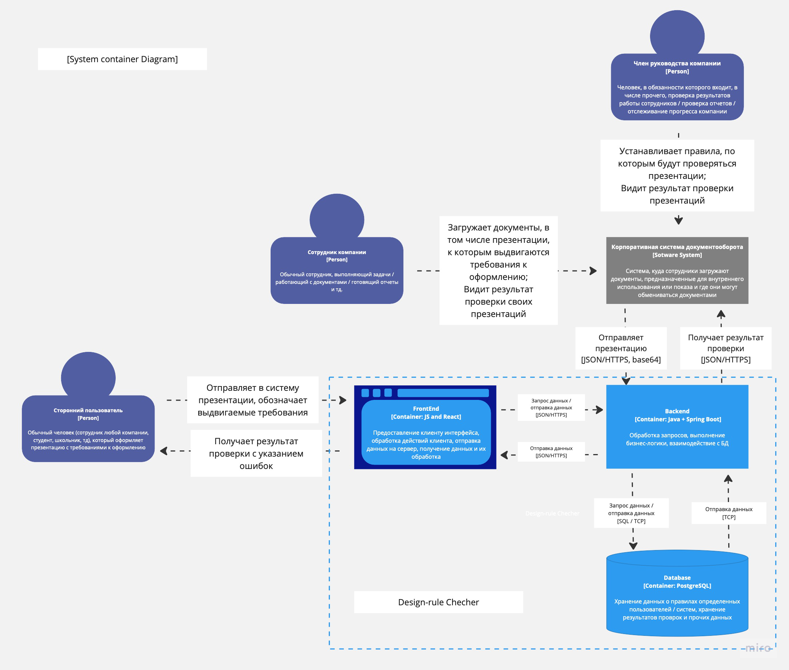
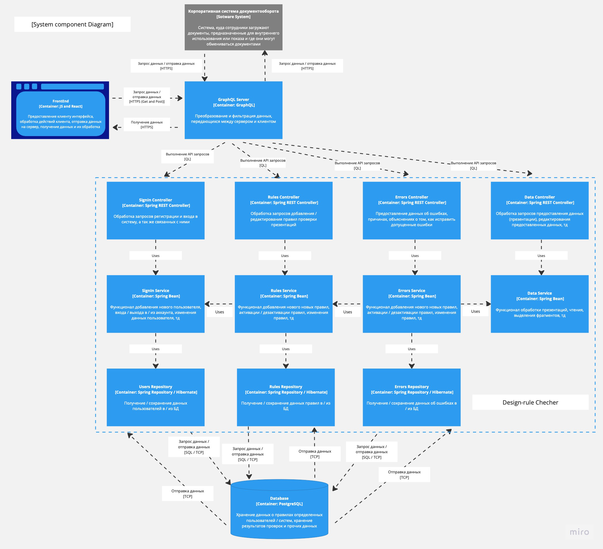

<h1>Лабораторная работа №2</h1>
<a href="../task/Задание.txt">Условие работы</a>
<h2>Диаграмма системого контекста</h2>

<h2>Диаграмма контейнеров</h2>

В силу того, что разрабатываемое приложение является веб-системой, оно было реализовано с использованием стандартной клиент-серверной архитектуры, в качестве архитектурного паттерна для серверной части использовался MVC (Model-View-Controller). Клиентская часть приложения реализована в виде веб-интерфейса и существует для того, чтобы любой пользователь, имеющий доступ к сети Интернет, мог использовать возможности платформы. Серверная часть разделена на: Model - систему сущностей, которыми являются: пользователь, презентация, правило, тд; View - систему классов и методов, реализующих бизнес-логику приложения; Controller - систему классов, описыващих методы, которые могут вызываться клиентской частью или сторонней системой.

<h2>Диаграмма компонентов</h2>

