# Описание API
В работе описано API для работы с правилами проверки презентаций (Rules) и с группами таких правил (Group).  Запросы представлены без авторизации, которая подразумевает использование Spring Security. Строки запросов представлены с учетом локального запуска приложения на 8080 порте. Подразумевается, что Get-запросах тело отсутствует по умолчанию.
## Правила (Rules)
### getRules
**Описание:** Метод возвращает все имеющиеся в БД правила оформления презентаций.\
**Запрос:** http://localhost:8080/rules/ \
**Метод:** Get.\
**Входные параметры:** Нет.\
**Пример ответа:**
```json
[
    {
        "id": 1,
        "description": "First",
        "parameters": [
            1,
            2,
            3
        ]
    },
    {
        "id": 2,
        "description": "Second",
        "parameters": [
            1,
            2,
            3
        ]
    }
]
```
**Описание ответа:** В ответе возвращается список правил с их описанием и списком параметров.
#### Тестирование
**Запрос:**
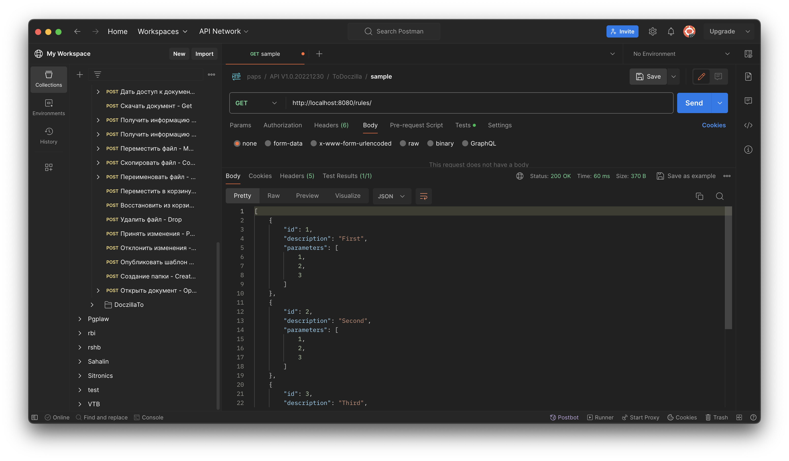
**Тест:**
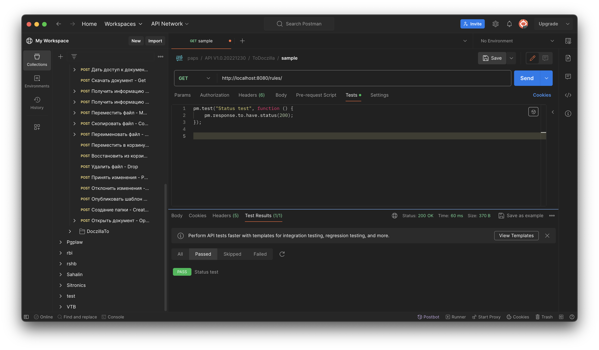

### getRule
**Описание:** Метод возвращает конкретное правило оформления презентаций.\
**Запрос:** http://localhost:8080/rules/{id} \
**Метод:** Get.\
**Входные параметры:**
| Параметр | Тип параметра | Тип данных параметра
| ----------- | ----------- | ------------------- |
|     id    |      path   |         Long          |

**Пример ответа ({id} = 3):**
```json
{
    "id": 3,
    "description": "Third",
    "parameters": [
        1,
        5
    ]
}
```
**Описание ответа:** В ответе возвращается правило с описанием и списком его параметров.
#### Тестирование
**Запрос:**
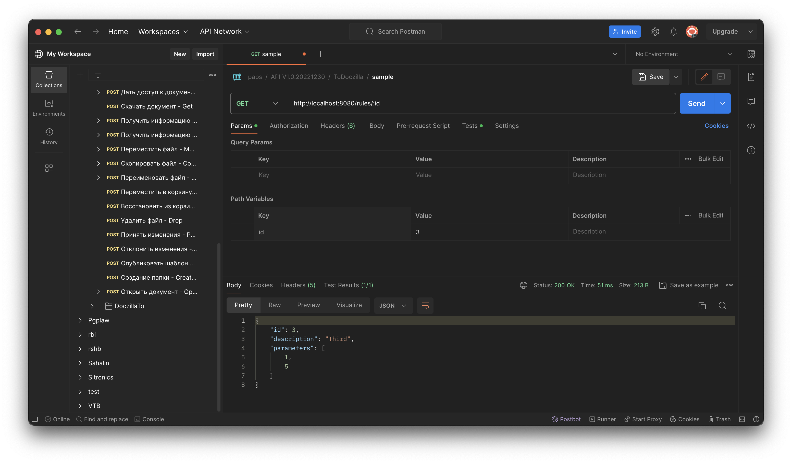
**Тест:**
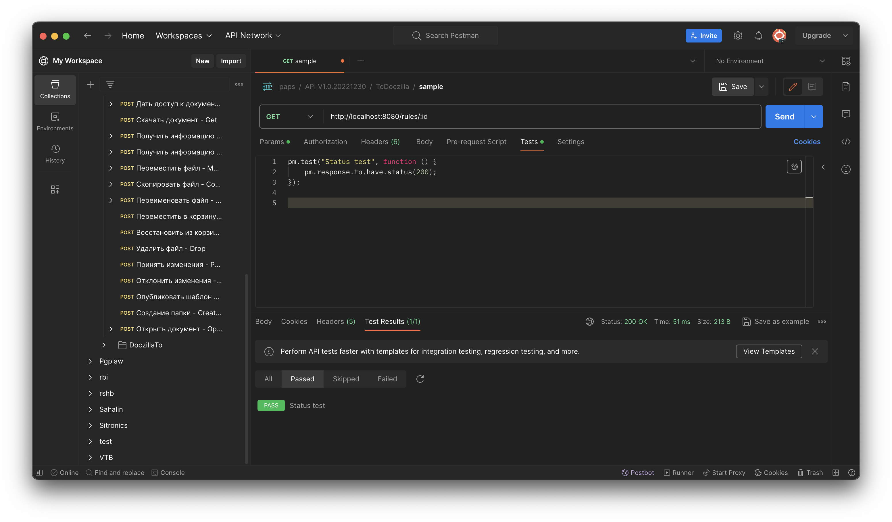

### addRule
**Описание:** Метод добавляет правило оформления презентаций.\
**Запрос:** http://localhost:8080/rules/ \
**Метод:** POST.\
**Входные параметры:** Нет \
**Пример тела запроса:**
```json
{
    "description": "Third",
    "parameters": [1, 5]
}
```
**Тело ответа:** Нет \
**Описание ответа:** Приходит только код успеха
#### Тестирование
**Запрос:**
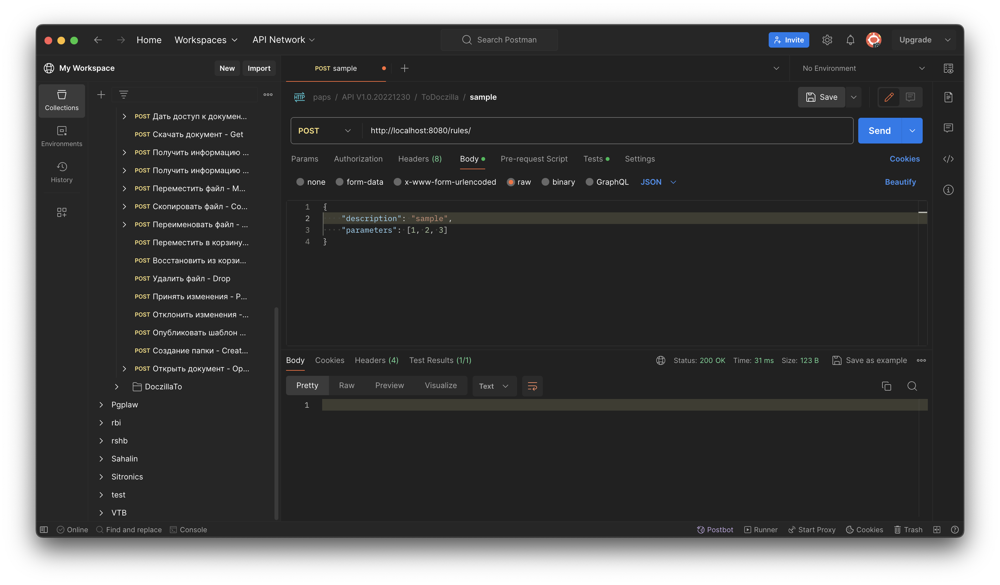
**Тест:**


### modifyRule
**Описание:** Метод изменяет правило оформления презентаций.\
**Запрос:** http://localhost:8080/rules/{id} \
**Метод:** PUT.\
**Входные параметры:**
| Параметр | Тип параметра | Тип данных параметра
| ----------- | ----------- | ------------------- |
|     id    |      path   |         Long          |

**Пример тела запроса:**
```json
{
    "description": "Forth",
    "parameters": [1, 5]
}
```
**Тело ответа:** Нет \
**Описание ответа:** Приходит только код успеха
#### Тестирование
**Запрос:**
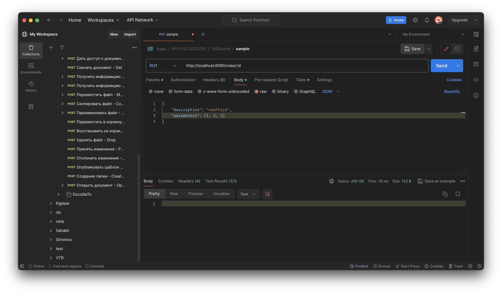
**Запрос (параметры):**
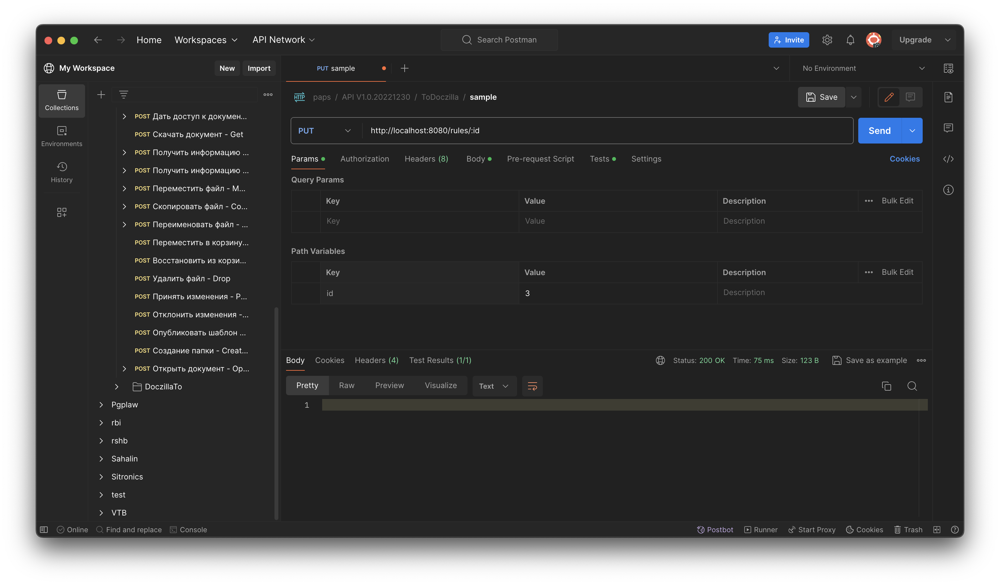
**Тест:**
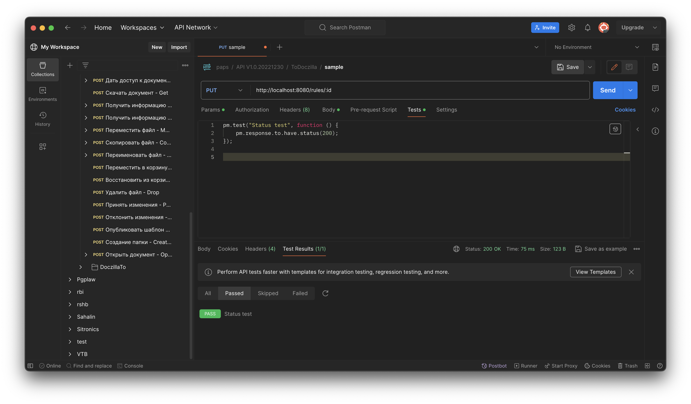

### deleteRule
**Описание:** Метод удаляет правило оформления презентаций.\
**Запрос:** http://localhost:8080/rules/{id} \
**Метод:** DELETE.\
**Входные параметры:**
| Параметр | Тип параметра | Тип данных параметра
| ----------- | ----------- | ------------------- |
|     id    |      path   |         Long          |

**Пример тела запроса:** Нет \
**Тело ответа:** Нет \
**Описание ответа:** Приходит только код успеха
#### Тестирование
**Запрос:**
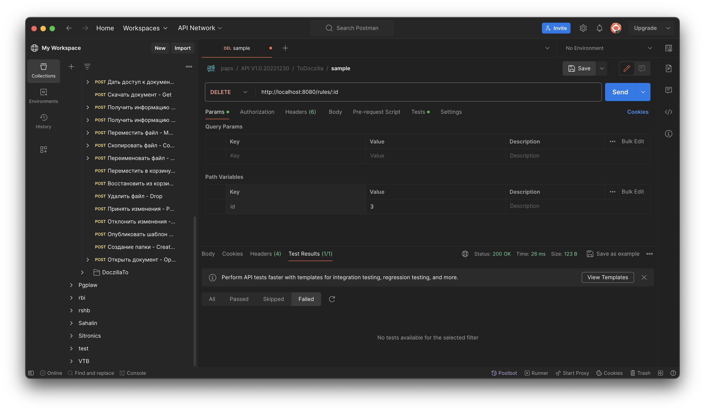
**Тест:**


## Группы (Group)
### getGroups
**Описание:** Метод возвращает все имеющиеся в БД группы правил оформления презентаций.\
**Запрос:** http://localhost:8080/group/ \
**Метод:** Get.\
**Входные параметры:** Нет.\
**Пример ответа:**
```json
[
    {
        "id": 1,
        "description": "First",
        "active": true,
        "rules": []
    },
    {
        "id": 2,
        "description": "First",
        "active": true,
        "rules": [
            {
                "id": 1,
                "description": "First",
                "parameters": [
                    1,
                    2,
                    3
                ]
            }
        ]
    },
]
```
**Описание ответа:** В ответе возвращается список групп правил с их описанием, значением активации и списком их правил.
#### Тестирование
**Запрос:**
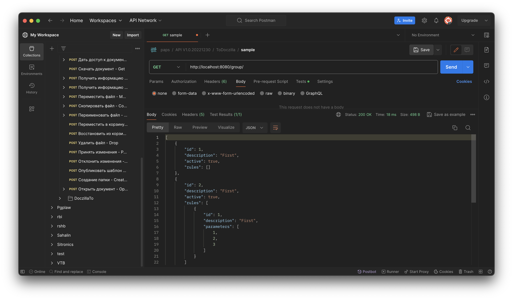
**Тест:**
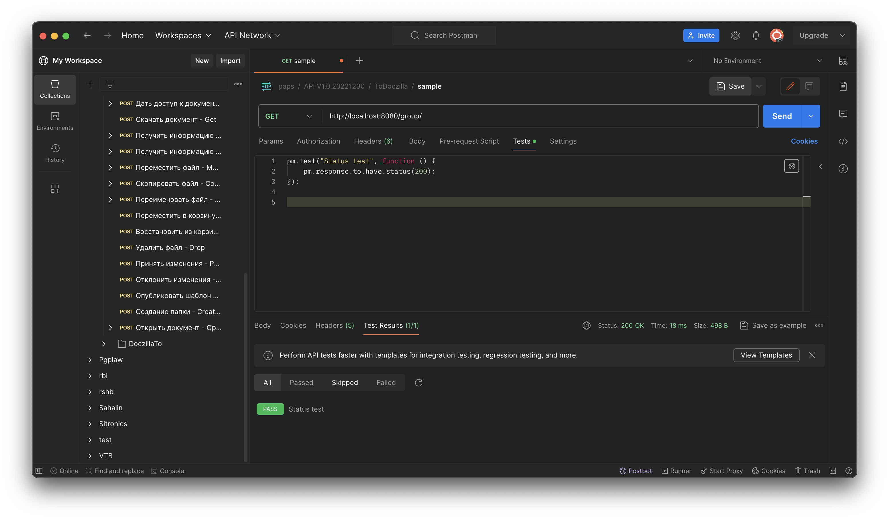

### getGroup
**Описание:** Метод возвращает конкретную группу правил оформления презентаций.\
**Запрос:** http://localhost:8080/group/{id} \
**Метод:** Get.\
**Входные параметры:**
| Параметр | Тип параметра | Тип данных параметра
| ----------- | ----------- | ------------------- |
|     id    |      path   |         Long          |

**Пример ответа ({id} = 2):**
```json
{
    "id": 2,
    "description": "First",
    "active": true,
    "rules": [
        {
            "id": 1,
            "description": "First",
            "parameters": [
                1,
                2,
                3
            ]
        }
    ]
}
```
**Описание ответа:** В ответе возвращается группf правил с описанием, значением активации и списком правил.
#### Тестирование
**Запрос:**
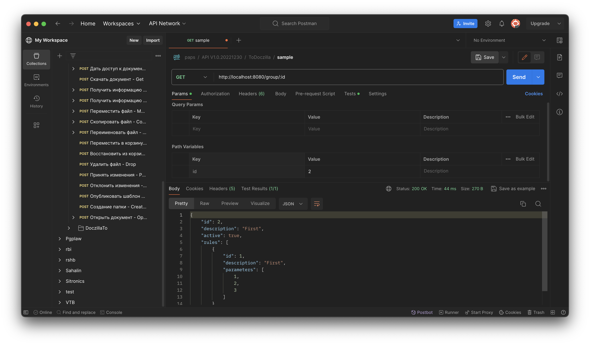
**Тест:**


### addGroup
**Описание:** Метод добавляет группу правил оформления презентаций.\
**Запрос:** http://localhost:8080/group/ \
**Метод:** POST.\
**Входные параметры:** Нет \
**Пример тела запроса:**
```json
{
    "description": "Forth",
    "active": false
}
```
**Тело ответа:** Нет \
**Описание ответа:** Приходит только код успеха
#### Тестирование
**Запрос:**

**Тест:**
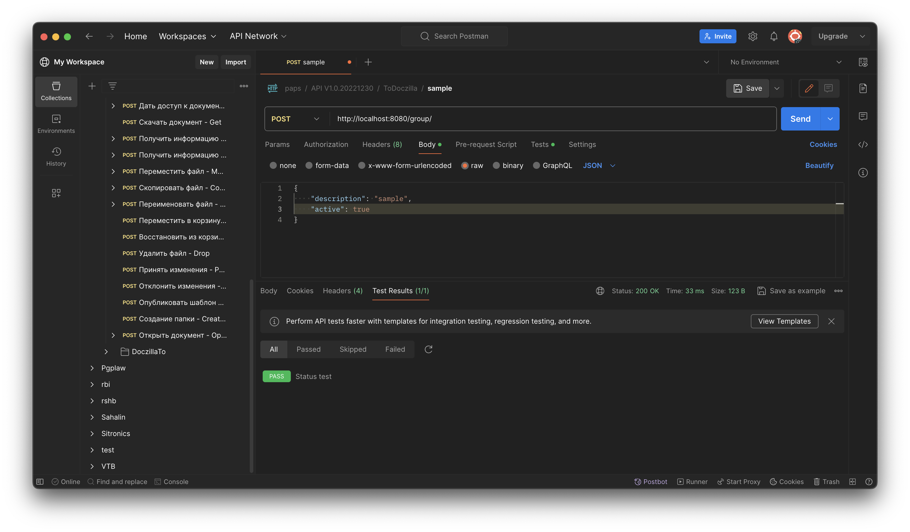

### modifyGroup
**Описание:** Метод изменяет группу правил оформления презентаций.\
**Запрос:** http://localhost:8080/group/{id} \
**Метод:** PUT.\
**Входные параметры:**
| Параметр | Тип параметра | Тип данных параметра
| ----------- | ----------- | ------------------- |
|     id    |      path   |         Long          |

**Пример тела запроса:**
```json
{
    "description": "Forth",
    "active": false
}
```
**Тело ответа:** Нет \
**Описание ответа:** Приходит только код успеха
#### Тестирование
**Запрос:**

**Запрос (параметры):**
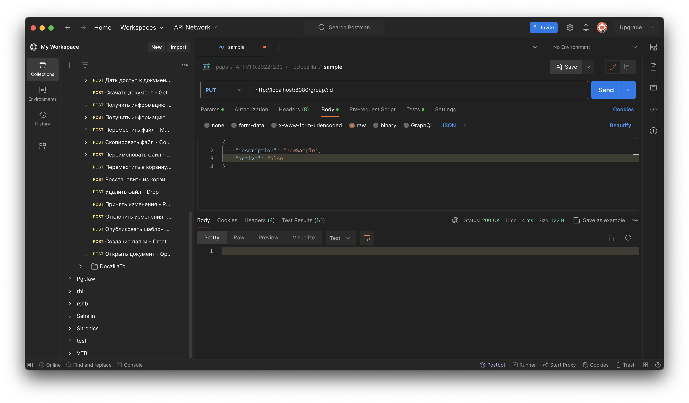
**Тест:**
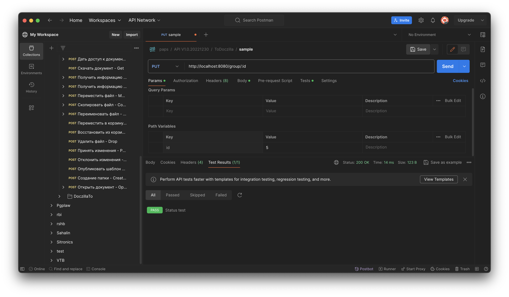

### deleteGroup
**Описание:** Метод удаляет группу правил оформления презентаций.\
**Запрос:** http://localhost:8080/group/{id} \
**Метод:** DELETE.\
**Входные параметры:**
| Параметр | Тип параметра | Тип данных параметра
| ----------- | ----------- | ------------------- |
|     id    |      path   |         Long          |

**Пример тела запроса:** Нет \
**Тело ответа:** Нет \
**Описание ответа:** Приходит только код успеха
#### Тестирование
**Запрос:**
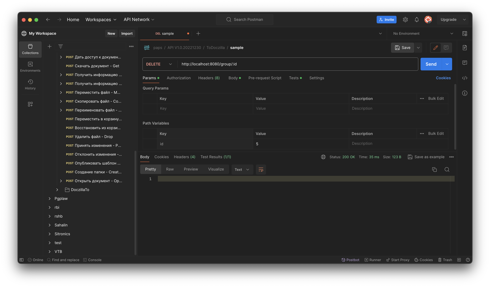
**Тест:**
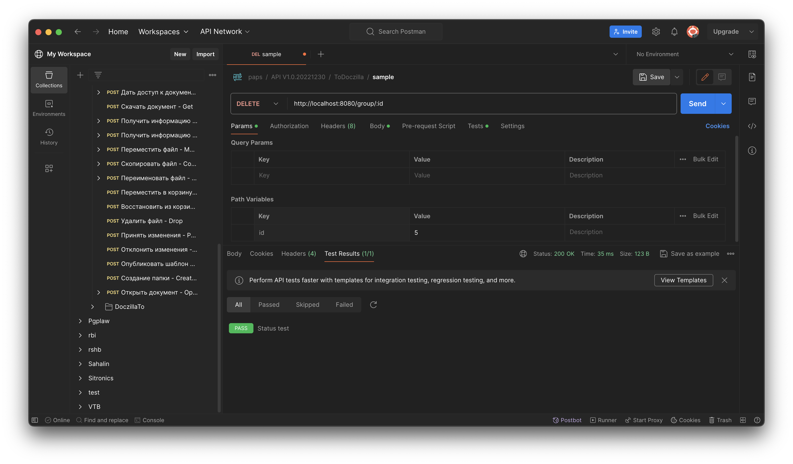

### addRuleToGroup
**Описание:** Метод добавляет правило в группу правил оформления презентаций.\
**Запрос:** http://localhost:8080/group/{id}/add-rules \
**Метод:** PUT.\
**Входные параметры:**
| Параметр | Тип параметра | Тип данных параметра
| ----------- | ----------- | ------------------- |
|     id    |      path   |         Long          |
|    rules    |    query   |         List`<Long>`  |

**Пример тела запроса:** Нет /
**Тело ответа:** Нет \
**Описание ответа:** Приходит только код успеха
#### Тестирование
**Запрос:**
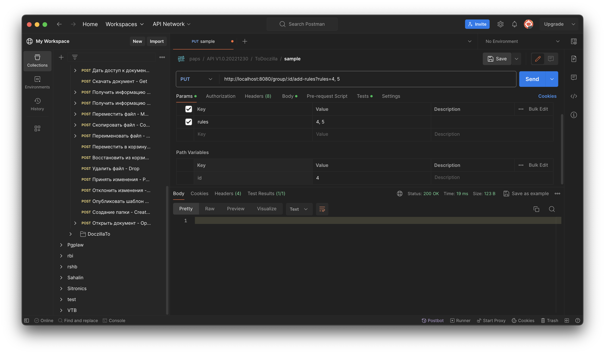
**Тест:**


### deleteRuleFromGroup
**Описание:** Метод добавляет правило в группу правил оформления презентаций.\
**Запрос:** http://localhost:8080/group/{id}/delete-rules \
**Метод:** PUT.\
**Входные параметры:**
| Параметр | Тип параметра | Тип данных параметра
| ----------- | ----------- | ------------------- |
|     id    |      path   |         Long          |
|    rules    |    query   |         List`<Long>`  |

**Пример тела запроса:** Нет /
**Тело ответа:** Нет \
**Описание ответа:** Приходит только код успеха
#### Тестирование
**Запрос:**

**Тест:**
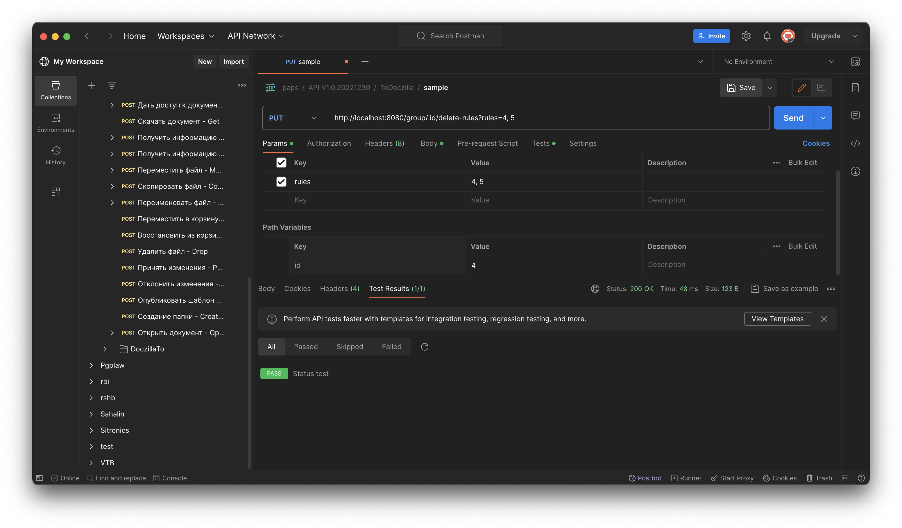
